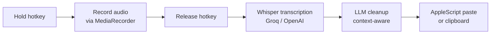

# OpenFlow

**Free, open-source voice dictation. Bring your own API key.**

> Press and hold a hotkey, speak, release — your cleaned-up text appears wherever your cursor is. No subscription. No account. No screenshots.

---

## Features

- **Push-to-talk** — hold Right Option (⌥) anywhere in the OS, speak, release. Done.
- **Context-aware cleanup** — detects Slack, Gmail, VS Code, Notion and adjusts tone automatically
- **Command mode** — highlight text, hold ⌘⇧Space, dictate an edit ("make this a bullet list")
- **Dev mode** — preserves camelCase, snake_case, file paths, jargon in coding apps
- **BYOK** — bring your own Groq, OpenAI, or Anthropic key. Groq is free and blazing fast.
- **Clipboard fallback** — if auto-paste isn't available, text is copied with a ⌘V reminder

## vs. the paid alternatives

| | **OpenFlow** | Wispr Flow | SuperWhisper | Voibe |
|---|---|---|---|---|
| Price | Free | $180/yr | $85/yr | $50/yr |
| Open source | ✓ | ✗ | ✗ | ✗ |
| Bring your own key | ✓ | ✗ | ✗ | ✗ |
| Takes screenshots | **Never** | ✓ | ✗ | ✗ |
| macOS | ✓ | ✓ | ✓ | ✓ |
| Windows | ✓ | ✗ | ✗ | ✗ |

## Quick start

1. Download the latest `.dmg` (Mac) or `.exe` (Windows) from [Releases](../../releases)
2. Open OpenFlow — the setup wizard appears
3. Paste your [Groq API key](https://console.groq.com) (free, takes 30 seconds)
4. Hold **Right Option (⌥)** anywhere and speak

## How it works

Your audio goes: **mic → your API key → your cursor**. OpenFlow is the courier, not the destination.

## FAQ

**Is this really free?**
OpenFlow itself is free and open source. You pay only for API calls — with Groq, a typical dictation costs less than $0.001.

**How much does BYOK actually cost?**
Groq's `whisper-large-v3-turbo` costs roughly $0.04/hour of audio. At 10 minutes of dictation a day, that's about $0.007/day — under $3/year.

**Why not local Whisper?**
Local inference requires a GPU or is very slow on CPU. API-based transcription is faster, cheaper for most users, and avoids a 1–2 GB model download. Local support is planned for v2.

**Does OpenFlow see my screen?**
No. This is an explicit anti-feature. Wispr Flow captures screenshots for "context." We don't. We never will.

**Does it work offline?**
No — transcription requires an API call. Offline support is planned for v2 via local Whisper.

## Contributing

See [CONTRIBUTING.md](CONTRIBUTING.md). MIT licensed — PRs welcome.
