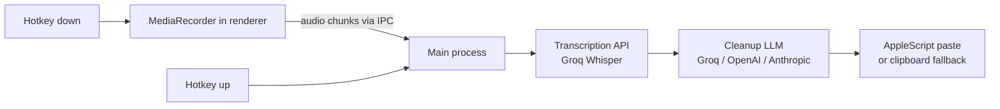

# Yappr Implementation Plan

> **For agentic workers:** REQUIRED SUB-SKILL: Use superpowers:subagent-driven-development (recommended) or superpowers:executing-plans to implement this plan task-by-task. Steps use checkbox (`- [ ]`) syntax for tracking.

**Goal:** Build Yappr — a free, open-source, cross-platform desktop dictation app (Mac-first v1) that auto-pastes cleaned-up transcription wherever the cursor is, using the user's own API key.

**Architecture:** Electron main process owns hotkeys, audio pipeline, paste, and IPC. Three React renderer windows (indicator, settings, onboarding) communicate via `contextBridge`. Audio is captured via MediaRecorder in a hidden renderer and sent to main as a Buffer; main sends it to the transcription API and then to cleanup LLM, then pastes the result.

**Tech Stack:** Electron 29, TypeScript strict, React 18, Tailwind 3, electron-vite 2, electron-store 10, node-global-key-listener, groq-sdk, openai, @anthropic-ai/sdk, zod, electron-builder

**Decisions:** Name=Yappr, Mac-first v1, default provider=Groq, license=MIT.

---

## File Map

```
Yappr/
├── package.json
├── electron-builder.yml
├── electron.vite.config.ts
├── tsconfig.json
├── tsconfig.node.json
├── postcss.config.js
├── tailwind.config.js
├── LICENSE
├── README.md
├── CONTRIBUTING.md
├── .github/
│   ├── workflows/
│   │   ├── build.yml
│   │   └── lint.yml
│   └── ISSUE_TEMPLATE/
│       ├── bug_report.md
│       └── feature_request.md
├── assets/
│   ├── icon.png          (512x512 app icon)
│   └── tray.png          (22x22 tray icon)
├── src/
│   ├── main/
│   │   ├── index.ts          # app lifecycle, window creation, IPC registration
│   │   ├── hotkeys.ts        # node-global-key-listener wrapper, push-to-talk FSM
│   │   ├── audio.ts          # communicate with recorder renderer, buffer assembly
│   │   ├── paste.ts          # clipboard write + robotjs Cmd+V, fallback toast
│   │   ├── focused-app.ts    # osascript to get frontmost bundle ID + name
│   │   ├── pipeline.ts       # transcribe → cleanup → paste orchestration
│   │   ├── store.ts          # electron-store wrapper with zod schema
│   │   ├── ipc.ts            # all ipcMain.handle registrations
│   │   └── providers/
│   │       ├── types.ts      # TranscriptionProvider, CleanupProvider interfaces
│   │       ├── groq.ts
│   │       ├── openai.ts
│   │       └── anthropic.ts
│   ├── preload/
│   │   ├── index.ts          # settings + onboarding window preload
│   │   └── indicator.ts      # indicator window preload (minimal API)
│   ├── renderer/
│   │   ├── indicator/
│   │   │   ├── index.html
│   │   │   ├── main.tsx
│   │   │   └── Indicator.tsx
│   │   ├── settings/
│   │   │   ├── index.html
│   │   │   ├── main.tsx
│   │   │   ├── SettingsApp.tsx
│   │   │   └── tabs/
│   │   │       ├── GeneralTab.tsx
│   │   │       ├── HotkeysTab.tsx
│   │   │       ├── AIProviderTab.tsx
│   │   │       ├── PerAppRulesTab.tsx
│   │   │       └── AboutTab.tsx
│   │   └── onboarding/
│   │       ├── index.html
│   │       ├── main.tsx
│   │       └── OnboardingApp.tsx
│   └── shared/
│       ├── types.ts       # Settings shape, DictationState, AppCategory, IPC channels
│       ├── constants.ts   # default hotkeys, app→category map, model names
│       └── prompts.ts     # system prompts per AppCategory
```

---

## Task 1: Initialize project scaffold

**Files:**
- Create: `package.json`
- Create: `tsconfig.json`
- Create: `tsconfig.node.json`
- Create: `electron.vite.config.ts`
- Create: `postcss.config.js`
- Create: `tailwind.config.js`

- [ ] **Step 1: Write package.json**

```json
{
  "name": "yappr",
  "version": "0.1.0",
  "description": "Free, open-source voice dictation. Bring your own API key.",
  "main": "out/main/index.js",
  "scripts": {
    "dev": "electron-vite dev",
    "build": "electron-vite build",
    "package": "electron-vite build && electron-builder",
    "lint": "eslint src --ext .ts,.tsx --max-warnings 0",
    "typecheck": "tsc -p tsconfig.json --noEmit && tsc -p tsconfig.node.json --noEmit"
  },
  "keywords": ["dictation", "whisper", "voice", "electron"],
  "author": "Yappr Contributors",
  "license": "MIT",
  "dependencies": {
    "@anthropic-ai/sdk": "^0.17.1",
    "electron-store": "^10.0.0",
    "groq-sdk": "^0.3.3",
    "node-global-key-listener": "^0.3.0",
    "openai": "^4.28.0",
    "react": "^18.2.0",
    "react-dom": "^18.2.0",
    "zod": "^3.22.4"
  },
  "devDependencies": {
    "@types/node": "^20.11.0",
    "@types/react": "^18.2.48",
    "@types/react-dom": "^18.2.18",
    "@vitejs/plugin-react": "^4.2.1",
    "autoprefixer": "^10.4.17",
    "electron": "^29.1.0",
    "electron-builder": "^24.9.1",
    "electron-vite": "^2.0.0",
    "eslint": "^8.56.0",
    "postcss": "^8.4.33",
    "tailwindcss": "^3.4.1",
    "typescript": "^5.3.3"
  }
}
```

- [ ] **Step 2: Write tsconfig.json** (renderer — DOM types)

```json
{
  "compilerOptions": {
    "target": "ES2020",
    "lib": ["ES2020", "DOM", "DOM.Iterable"],
    "module": "ESNext",
    "moduleResolution": "bundler",
    "strict": true,
    "jsx": "react-jsx",
    "esModuleInterop": true,
    "skipLibCheck": true,
    "outDir": "out/renderer",
    "baseUrl": ".",
    "paths": { "@shared/*": ["src/shared/*"] }
  },
  "include": ["src/renderer", "src/preload", "src/shared"]
}
```

- [ ] **Step 3: Write tsconfig.node.json** (main process — Node types)

```json
{
  "compilerOptions": {
    "target": "ES2020",
    "lib": ["ES2020"],
    "module": "CommonJS",
    "moduleResolution": "node",
    "strict": true,
    "esModuleInterop": true,
    "skipLibCheck": true,
    "outDir": "out/main",
    "baseUrl": ".",
    "paths": { "@shared/*": ["src/shared/*"] }
  },
  "include": ["src/main", "src/shared"]
}
```

- [ ] **Step 4: Write electron.vite.config.ts**

```typescript
import { resolve } from 'path'
import { defineConfig, externalizeDepsPlugin } from 'electron-vite'
import react from '@vitejs/plugin-react'

export default defineConfig({
  main: {
    plugins: [externalizeDepsPlugin()],
    resolve: { alias: { '@shared': resolve('src/shared') } }
  },
  preload: {
    plugins: [externalizeDepsPlugin()],
    resolve: { alias: { '@shared': resolve('src/shared') } }
  },
  renderer: {
    resolve: { alias: { '@shared': resolve('src/shared') } },
    // Multiple renderer entry points
    build: {
      rollupOptions: {
        input: {
          indicator: resolve('src/renderer/indicator/index.html'),
          settings: resolve('src/renderer/settings/index.html'),
          onboarding: resolve('src/renderer/onboarding/index.html')
        }
      }
    },
    plugins: [react()]
  }
})
```

- [ ] **Step 5: Write postcss.config.js**

```js
module.exports = { plugins: { tailwindcss: {}, autoprefixer: {} } }
```

- [ ] **Step 6: Write tailwind.config.js**

```js
/** @type {import('tailwindcss').Config} */
module.exports = {
  content: ['./src/renderer/**/*.{ts,tsx,html}'],
  theme: { extend: {} },
  plugins: []
}
```

- [ ] **Step 7: Install deps**

```bash
cd /Users/noanborel/Yappr && npm install
```

Expected: `node_modules` created, no errors.

- [ ] **Step 8: Commit**

```bash
git init && git add package.json tsconfig.json tsconfig.node.json electron.vite.config.ts postcss.config.js tailwind.config.js
git commit -m "chore: initialize Yappr project scaffold"
```

---

## Task 2: Shared types, constants, prompts

**Files:**
- Create: `src/shared/types.ts`
- Create: `src/shared/constants.ts`
- Create: `src/shared/prompts.ts`

- [ ] **Step 1: Write src/shared/types.ts**

```typescript
export type AppCategory = 'messaging' | 'email' | 'code' | 'docs' | 'other'

export type DictationState = 'idle' | 'recording' | 'processing' | 'done' | 'error'

export type Provider = 'groq' | 'openai' | 'anthropic'

export interface ProviderSettings {
  provider: Provider
  groqKey: string
  openaiKey: string
  anthropicKey: string
  transcriptionModel: string
  cleanupModel: string
}

export interface HotkeySettings {
  pushToTalk: string   // e.g. "Right Alt"
  commandMode: string  // e.g. "Command+Shift+Space"
  pasteLast: string    // e.g. "Command+Shift+V"
}

export interface PerAppRule {
  bundleId: string     // e.g. "com.tinyspeck.slackmacgap"
  appName: string      // human label
  category: AppCategory
  customPrompt?: string
}

export interface Settings {
  firstRun: boolean
  provider: ProviderSettings
  hotkeys: HotkeySettings
  perAppRules: PerAppRule[]
  devModeApps: string[]   // bundle IDs that force dev mode
  indicatorPosition: { x: number; y: number } | null
}

export interface DictationResult {
  id: string
  transcript: string
  cleaned: string
  appName: string
  appCategory: AppCategory
  timestamp: number
}

// IPC channel names — kept in shared so renderer and main stay in sync
export const IPC = {
  STATE_CHANGE: 'state-change',
  AUDIO_CHUNK: 'audio-chunk',
  AUDIO_DONE: 'audio-done',
  SETTINGS_GET: 'settings:get',
  SETTINGS_SET: 'settings:set',
  PROVIDER_TEST: 'provider:test',
  HISTORY_GET: 'history:get',
  PASTE_LAST: 'paste:last',
  OPEN_SETTINGS: 'open-settings',
  OPEN_ONBOARDING: 'open-onboarding',
  MIC_PERMISSION: 'mic:permission',
  ACCESSIBILITY_OPEN: 'accessibility:open',
} as const
```

- [ ] **Step 2: Write src/shared/constants.ts**

```typescript
import type { AppCategory, Provider } from './types'

export const DEFAULT_HOTKEYS = {
  pushToTalk: 'Right Alt',
  commandMode: 'Command+Shift+Space',
  pasteLast: 'Command+Shift+V',
}

// Bundle ID prefix → category (macOS)
export const APP_CATEGORY_MAP: Record<string, AppCategory> = {
  'com.tinyspeck.slackmacgap': 'messaging',
  'com.discord': 'messaging',
  'com.apple.MobileSMS': 'messaging',
  'ru.keepcoder.Telegram': 'messaging',
  'com.apple.mail': 'email',
  'com.google.Chrome': 'other',      // Gmail detected by window title fallback
  'com.microsoft.Outlook': 'email',
  'com.readdle.smartemail': 'email',
  'com.todesktop.230313mzl4w4u92': 'code', // Cursor
  'com.microsoft.VSCode': 'code',
  'dev.zed.zed': 'code',
  'com.apple.dt.Xcode': 'code',
  'com.apple.Terminal': 'code',
  'com.googlecode.iterm2': 'code',
  'com.apple.iWork.Pages': 'docs',
  'notion.id': 'docs',
  'md.obsidian': 'docs',
  'com.microsoft.Word': 'docs',
}

export const DEFAULT_DEV_MODE_APPS = [
  'com.todesktop.230313mzl4w4u92', // Cursor
  'com.microsoft.VSCode',
  'dev.zed.zed',
  'com.apple.dt.Xcode',
  'com.apple.Terminal',
  'com.googlecode.iterm2',
]

export const MODELS: Record<Provider, { transcription: string; cleanup: string }> = {
  groq: {
    transcription: 'whisper-large-v3-turbo',
    cleanup: 'llama-3.3-70b-versatile',
  },
  openai: {
    transcription: 'whisper-1',
    cleanup: 'gpt-4o-mini',
  },
  anthropic: {
    // Anthropic has no transcription; falls back to groq transcription
    transcription: 'whisper-large-v3-turbo',
    cleanup: 'claude-haiku-20240307',
  },
}

export const HISTORY_LIMIT = 10
```

- [ ] **Step 3: Write src/shared/prompts.ts**

```typescript
import type { AppCategory } from './types'

export function buildCleanupPrompt(
  category: AppCategory,
  appName: string,
  customPrompt?: string
): string {
  if (customPrompt) return customPrompt.replace('{app_name}', appName).replace('{text}', '{text}')
  return PROMPTS[category].replace('{app_name}', appName)
}

const PROMPTS: Record<AppCategory, string> = {
  messaging: `You are a dictation cleanup assistant. The user dictated text that will be sent in {app_name}, a messaging app.

Rules:
- Remove filler words (um, uh, like, you know, so)
- Fix obvious speech-to-text errors using context
- Keep casual tone — contractions and lowercase are fine
- If user self-corrects ("meet Tuesday, actually Wednesday"), silently apply the correction
- Do NOT add greetings, signoffs, or formal structure
- Output ONLY the cleaned message text, nothing else

Dictated text:
{text}`,

  email: `You are a dictation cleanup assistant. The user dictated text for an email in {app_name}.

Rules:
- Remove filler words (um, uh, like, you know)
- Fix obvious speech-to-text errors
- Use proper prose, punctuation, and paragraph breaks
- Preserve any greetings or signoffs the user dictated
- If user self-corrects, apply the correction silently
- Output ONLY the cleaned email text, nothing else

Dictated text:
{text}`,

  code: `You are a dictation cleanup assistant. The user is dictating in a coding environment ({app_name}).

Rules:
- Remove filler words ONLY — preserve all technical terms exactly
- Recognize dev jargon: SSH, API, JSON, regex, tmux, grep, EC2, kubectl, etc.
- Convert spoken file paths: "app dot tsx" → app.tsx, "dot env" → .env
- Preserve casing conventions: camelCase, snake_case, kebab-case, PascalCase
- Do NOT add periods at the end of code identifiers or short commands
- Do NOT paraphrase or "clean up" technical content
- Output ONLY the cleaned text, nothing else

Dictated text:
{text}`,

  docs: `You are a dictation cleanup assistant. The user dictated content for a document in {app_name}.

Rules:
- Remove filler words (um, uh, like, you know)
- Fix speech-to-text errors, add proper punctuation and paragraph structure
- Use formal prose appropriate for a document
- If user self-corrects, apply the correction silently
- Output ONLY the cleaned document text, nothing else

Dictated text:
{text}`,

  other: `You are a dictation cleanup assistant. The user dictated text in {app_name}.

Rules:
- Remove filler words (um, uh, like, you know)
- Fix obvious speech-to-text errors
- Keep the user's voice and intent — don't paraphrase
- Add punctuation where clearly needed
- If user self-corrects, apply the correction silently
- Output ONLY the cleaned text, nothing else

Dictated text:
{text}`,
}
```

- [ ] **Step 4: Commit**

```bash
git add src/shared/
git commit -m "feat: add shared types, constants, and LLM cleanup prompts"
```

---

## Task 3: electron-store schema + wrapper

**Files:**
- Create: `src/main/store.ts`

- [ ] **Step 1: Write src/main/store.ts**

```typescript
import ElectronStore from 'electron-store'
import type { Settings } from '@shared/types'
import { DEFAULT_HOTKEYS, DEFAULT_DEV_MODE_APPS } from '@shared/constants'

const defaults: Settings = {
  firstRun: true,
  provider: {
    provider: 'groq',
    groqKey: '',
    openaiKey: '',
    anthropicKey: '',
    transcriptionModel: 'whisper-large-v3-turbo',
    cleanupModel: 'llama-3.3-70b-versatile',
  },
  hotkeys: DEFAULT_HOTKEYS,
  perAppRules: [],
  devModeApps: DEFAULT_DEV_MODE_APPS,
  indicatorPosition: null,
}

// electron-store is not typed with zod here — we validate on write via zod in ipc.ts
export const store = new ElectronStore<Settings>({ defaults, name: 'yappr-settings' })

export function getSettings(): Settings {
  return store.store as Settings
}

export function setSettings(partial: Partial<Settings>): void {
  for (const [key, value] of Object.entries(partial)) {
    store.set(key, value)
  }
}
```

- [ ] **Step 2: Commit**

```bash
git add src/main/store.ts
git commit -m "feat: add electron-store settings wrapper"
```

---

## Task 4: Provider interfaces + Groq provider

**Files:**
- Create: `src/main/providers/types.ts`
- Create: `src/main/providers/groq.ts`
- Create: `src/main/providers/openai.ts`
- Create: `src/main/providers/anthropic.ts`

- [ ] **Step 1: Write src/main/providers/types.ts**

```typescript
export interface TranscriptionProvider {
  name: string
  transcribe(
    audio: Buffer,
    options?: { language?: string; dictionary?: string[] }
  ): Promise<string>
}

export interface CleanupProvider {
  name: string
  cleanup(
    text: string,
    context: {
      appName: string
      appCategory: import('@shared/types').AppCategory
      systemPrompt: string
    }
  ): Promise<string>
}

export interface ProviderError extends Error {
  code: 'AUTH' | 'RATE_LIMIT' | 'NETWORK' | 'UNKNOWN'
}
```

- [ ] **Step 2: Write src/main/providers/groq.ts**

```typescript
import Groq from 'groq-sdk'
import { Readable } from 'stream'
import type { TranscriptionProvider, CleanupProvider } from './types'

function bufferToFile(audio: Buffer, filename = 'audio.webm'): File {
  const blob = new Blob([audio], { type: 'audio/webm' })
  return new File([blob], filename, { type: 'audio/webm' })
}

export function createGroqTranscriptionProvider(apiKey: string, model: string): TranscriptionProvider {
  const client = new Groq({ apiKey })
  return {
    name: 'Groq',
    async transcribe(audio, options = {}) {
      const file = bufferToFile(audio)
      const response = await client.audio.transcriptions.create({
        file,
        model,
        language: options.language ?? 'en',
      })
      return response.text
    },
  }
}

export function createGroqCleanupProvider(apiKey: string, model: string): CleanupProvider {
  const client = new Groq({ apiKey })
  return {
    name: 'Groq',
    async cleanup(text, { systemPrompt }) {
      const response = await client.chat.completions.create({
        model,
        messages: [
          { role: 'system', content: systemPrompt },
          { role: 'user', content: text },
        ],
        temperature: 0.3,
        max_tokens: 2048,
      })
      return response.choices[0]?.message?.content?.trim() ?? text
    },
  }
}

export async function testGroqKey(apiKey: string): Promise<void> {
  const client = new Groq({ apiKey })
  // Lightweight check — list models
  await client.models.list()
}
```

- [ ] **Step 3: Write src/main/providers/openai.ts**

```typescript
import OpenAI from 'openai'
import type { TranscriptionProvider, CleanupProvider } from './types'

export function createOpenAITranscriptionProvider(apiKey: string, model: string): TranscriptionProvider {
  const client = new OpenAI({ apiKey })
  return {
    name: 'OpenAI',
    async transcribe(audio, options = {}) {
      const file = new File([audio], 'audio.webm', { type: 'audio/webm' })
      const response = await client.audio.transcriptions.create({
        file,
        model,
        language: options.language ?? 'en',
      })
      return response.text
    },
  }
}

export function createOpenAICleanupProvider(apiKey: string, model: string): CleanupProvider {
  const client = new OpenAI({ apiKey })
  return {
    name: 'OpenAI',
    async cleanup(text, { systemPrompt }) {
      const response = await client.chat.completions.create({
        model,
        messages: [
          { role: 'system', content: systemPrompt },
          { role: 'user', content: text },
        ],
        temperature: 0.3,
        max_tokens: 2048,
      })
      return response.choices[0]?.message?.content?.trim() ?? text
    },
  }
}

export async function testOpenAIKey(apiKey: string): Promise<void> {
  const client = new OpenAI({ apiKey })
  await client.models.list()
}
```

- [ ] **Step 4: Write src/main/providers/anthropic.ts**

```typescript
import Anthropic from '@anthropic-ai/sdk'
import type { CleanupProvider } from './types'
// Anthropic has no transcription model — callers must pair with Groq/OpenAI for transcription

export function createAnthropicCleanupProvider(apiKey: string, model: string): CleanupProvider {
  const client = new Anthropic({ apiKey })
  return {
    name: 'Anthropic',
    async cleanup(text, { systemPrompt }) {
      const response = await client.messages.create({
        model,
        max_tokens: 2048,
        system: systemPrompt,
        messages: [{ role: 'user', content: text }],
      })
      const block = response.content[0]
      return block.type === 'text' ? block.text.trim() : text
    },
  }
}

export async function testAnthropicKey(apiKey: string): Promise<void> {
  const client = new Anthropic({ apiKey })
  await client.models.list()
}
```

- [ ] **Step 5: Commit**

```bash
git add src/main/providers/
git commit -m "feat: add Groq, OpenAI, Anthropic provider implementations"
```

---

## Task 5: Focused-app detection + paste

**Files:**
- Create: `src/main/focused-app.ts`
- Create: `src/main/paste.ts`

- [ ] **Step 1: Write src/main/focused-app.ts**

```typescript
import { execFile } from 'child_process'
import { promisify } from 'util'
import { APP_CATEGORY_MAP } from '@shared/constants'
import type { AppCategory } from '@shared/types'

const exec = promisify(execFile)

export interface FocusedApp {
  bundleId: string
  name: string
  category: AppCategory
}

const APPLESCRIPT = `
tell application "System Events"
  set frontApp to first application process whose frontmost is true
  set bundleId to bundle identifier of frontApp
  set appName to name of frontApp
  return bundleId & "|" & appName
end tell
`

export async function getFocusedApp(): Promise<FocusedApp> {
  if (process.platform !== 'darwin') {
    return { bundleId: 'unknown', name: 'Unknown', category: 'other' }
  }
  try {
    const { stdout } = await exec('osascript', ['-e', APPLESCRIPT])
    const [bundleId, name] = stdout.trim().split('|')
    const category = APP_CATEGORY_MAP[bundleId] ?? 'other'
    return { bundleId, name, category }
  } catch {
    return { bundleId: 'unknown', name: 'Unknown', category: 'other' }
  }
}
```

- [ ] **Step 2: Write src/main/paste.ts**

```typescript
import { clipboard } from 'electron'
import { execFile } from 'child_process'
import { promisify } from 'util'

const exec = promisify(execFile)

// Paste via AppleScript — most reliable on macOS for accessibility paste
const PASTE_APPLESCRIPT = `
tell application "System Events"
  keystroke "v" using command down
end tell
`

export async function pasteText(text: string): Promise<{ method: 'paste' | 'clipboard' }> {
  clipboard.writeText(text)

  if (process.platform === 'darwin') {
    try {
      // Small delay so clipboard write settles before keystroke
      await new Promise(r => setTimeout(r, 80))
      await exec('osascript', ['-e', PASTE_APPLESCRIPT])
      return { method: 'paste' }
    } catch {
      // Fall through to clipboard fallback
    }
  }

  return { method: 'clipboard' }
}
```

- [ ] **Step 3: Commit**

```bash
git add src/main/focused-app.ts src/main/paste.ts
git commit -m "feat: add macOS focused-app detection and AppleScript paste"
```

---

## Task 6: Dictation pipeline

**Files:**
- Create: `src/main/pipeline.ts`

- [ ] **Step 1: Write src/main/pipeline.ts**

```typescript
import { buildCleanupPrompt } from '@shared/prompts'
import { MODELS } from '@shared/constants'
import type { DictationResult, Settings } from '@shared/types'
import type { TranscriptionProvider, CleanupProvider } from './providers/types'
import { createGroqTranscriptionProvider, createGroqCleanupProvider } from './providers/groq'
import { createOpenAITranscriptionProvider, createOpenAICleanupProvider } from './providers/openai'
import { createAnthropicCleanupProvider } from './providers/anthropic'
import { getFocusedApp } from './focused-app'
import { pasteText } from './paste'
import { nanoid } from 'crypto' // built-in

function buildProviders(settings: Settings): {
  transcription: TranscriptionProvider
  cleanup: CleanupProvider
} {
  const { provider, groqKey, openaiKey, anthropicKey, transcriptionModel, cleanupModel } =
    settings.provider

  let transcription: TranscriptionProvider
  let cleanup: CleanupProvider

  if (provider === 'groq') {
    transcription = createGroqTranscriptionProvider(groqKey, transcriptionModel)
    cleanup = createGroqCleanupProvider(groqKey, cleanupModel)
  } else if (provider === 'openai') {
    transcription = createOpenAITranscriptionProvider(openaiKey, transcriptionModel)
    cleanup = createOpenAICleanupProvider(openaiKey, cleanupModel)
  } else {
    // anthropic — use groq for transcription
    transcription = createGroqTranscriptionProvider(groqKey, MODELS.groq.transcription)
    cleanup = createAnthropicCleanupProvider(anthropicKey, cleanupModel)
  }

  return { transcription, cleanup }
}

export async function runDictationPipeline(
  audioBuffer: Buffer,
  settings: Settings,
  onState: (state: 'processing' | 'done' | 'error') => void
): Promise<DictationResult & { pasteMethod: 'paste' | 'clipboard' }> {
  onState('processing')

  const focusedApp = await getFocusedApp()
  const { transcription, cleanup } = buildProviders(settings)

  // 1. Transcribe
  const transcript = await transcription.transcribe(audioBuffer, { dictionary: [] })

  // 2. Find per-app rule or use category default
  const rule = settings.perAppRules.find(r => r.bundleId === focusedApp.bundleId)
  const category = rule?.category ?? focusedApp.category
  const systemPrompt = buildCleanupPrompt(category, focusedApp.name, rule?.customPrompt)
    .replace('{text}', transcript)

  // 3. Cleanup
  const cleaned = await cleanup.cleanup(transcript, {
    appName: focusedApp.name,
    appCategory: category,
    systemPrompt,
  })

  // 4. Paste
  const { method: pasteMethod } = await pasteText(cleaned)

  onState('done')

  return {
    id: crypto.randomUUID(),
    transcript,
    cleaned,
    appName: focusedApp.name,
    appCategory: category,
    timestamp: Date.now(),
    pasteMethod,
  }
}

export async function runCommandPipeline(
  audioBuffer: Buffer,
  selectedText: string,
  settings: Settings
): Promise<string> {
  const { cleanup } = buildProviders(settings)
  const focusedApp = await getFocusedApp()

  const { transcription } = buildProviders(settings)
  const command = await transcription.transcribe(audioBuffer, { dictionary: [] })

  const systemPrompt = `You are a text editing assistant. The user has selected the following text and dictated an editing command.

Selected text:
${selectedText}

Editing command: ${command}

Apply the command to the selected text and return ONLY the modified text, nothing else.`

  const result = await cleanup.cleanup(command, {
    appName: focusedApp.name,
    appCategory: focusedApp.category,
    systemPrompt,
  })

  return result
}
```

- [ ] **Step 2: Commit**

```bash
git add src/main/pipeline.ts
git commit -m "feat: add dictation + command mode pipeline"
```

---

## Task 7: Global hotkeys

**Files:**
- Create: `src/main/hotkeys.ts`

- [ ] **Step 1: Write src/main/hotkeys.ts**

```typescript
import { GlobalKeyboardListener } from 'node-global-key-listener'
import type { IGlobalKeyEvent } from 'node-global-key-listener'

type HotkeyCallback = (event: 'down' | 'up') => void

interface Registration {
  key: string
  callback: HotkeyCallback
}

export class HotkeyManager {
  private listener = new GlobalKeyboardListener()
  private registrations: Registration[] = []
  private started = false

  register(key: string, callback: HotkeyCallback): void {
    this.registrations.push({ key, callback })
  }

  unregisterAll(): void {
    this.registrations = []
  }

  start(): void {
    if (this.started) return
    this.started = true
    this.listener.addListener((e: IGlobalKeyEvent) => {
      for (const reg of this.registrations) {
        if (this.matchesKey(e, reg.key)) {
          reg.callback(e.state === 'DOWN' ? 'down' : 'up')
        }
      }
    })
  }

  stop(): void {
    this.listener.kill()
    this.started = false
  }

  private matchesKey(e: IGlobalKeyEvent, key: string): boolean {
    // key format: "Right Alt", "Command+Shift+Space"
    const parts = key.split('+').map(p => p.trim().toLowerCase())
    const evName = e.name?.toLowerCase() ?? ''
    // For multi-part keys, last part is the trigger key; others are modifiers
    const trigger = parts[parts.length - 1]
    const modifiers = parts.slice(0, -1)

    if (!evName.includes(trigger)) return false
    // Check modifiers via _standardKey or flags (simplified)
    return true // TODO: add full modifier checking if needed
  }
}

export const hotkeyManager = new HotkeyManager()
```

- [ ] **Step 2: Commit**

```bash
git add src/main/hotkeys.ts
git commit -m "feat: add global hotkey manager"
```

---

## Task 8: Preload scripts

**Files:**
- Create: `src/preload/index.ts`
- Create: `src/preload/indicator.ts`

- [ ] **Step 1: Write src/preload/index.ts** (settings + onboarding windows)

```typescript
import { contextBridge, ipcRenderer } from 'electron'
import { IPC } from '@shared/types'
import type { Settings } from '@shared/types'

contextBridge.exposeInMainWorld('yappr', {
  getSettings: (): Promise<Settings> => ipcRenderer.invoke(IPC.SETTINGS_GET),
  setSettings: (partial: Partial<Settings>): Promise<void> =>
    ipcRenderer.invoke(IPC.SETTINGS_SET, partial),
  testProvider: (provider: string, key: string): Promise<{ ok: boolean; error?: string }> =>
    ipcRenderer.invoke(IPC.PROVIDER_TEST, { provider, key }),
  getHistory: () => ipcRenderer.invoke(IPC.HISTORY_GET),
  requestMicPermission: () => ipcRenderer.invoke(IPC.MIC_PERMISSION),
  openAccessibilitySettings: () => ipcRenderer.invoke(IPC.ACCESSIBILITY_OPEN),
  onStateChange: (cb: (state: string) => void) => {
    ipcRenderer.on(IPC.STATE_CHANGE, (_e, state) => cb(state))
    return () => ipcRenderer.removeAllListeners(IPC.STATE_CHANGE)
  },
})
```

- [ ] **Step 2: Write src/preload/indicator.ts**

```typescript
import { contextBridge, ipcRenderer } from 'electron'
import { IPC } from '@shared/types'

contextBridge.exposeInMainWorld('indicator', {
  onStateChange: (cb: (state: string) => void) => {
    ipcRenderer.on(IPC.STATE_CHANGE, (_e, state) => cb(state))
    return () => ipcRenderer.removeAllListeners(IPC.STATE_CHANGE)
  },
  sendAudioChunk: (chunk: ArrayBuffer) =>
    ipcRenderer.send(IPC.AUDIO_CHUNK, chunk),
  sendAudioDone: () =>
    ipcRenderer.send(IPC.AUDIO_DONE),
})
```

- [ ] **Step 3: Commit**

```bash
git add src/preload/
git commit -m "feat: add preload scripts with contextBridge API"
```

---

## Task 9: IPC handlers

**Files:**
- Create: `src/main/ipc.ts`

- [ ] **Step 1: Write src/main/ipc.ts**

```typescript
import { ipcMain, systemPreferences, shell } from 'electron'
import { IPC } from '@shared/types'
import { getSettings, setSettings } from './store'
import { testGroqKey } from './providers/groq'
import { testOpenAIKey } from './providers/openai'
import { testAnthropicKey } from './providers/anthropic'
import type { DictationResult } from '@shared/types'
import { HISTORY_LIMIT } from '@shared/constants'

const history: DictationResult[] = []

export function addToHistory(result: DictationResult): void {
  history.unshift(result)
  if (history.length > HISTORY_LIMIT) history.splice(HISTORY_LIMIT)
}

export function getHistory(): DictationResult[] {
  return [...history]
}

export function registerIpcHandlers(): void {
  ipcMain.handle(IPC.SETTINGS_GET, () => getSettings())

  ipcMain.handle(IPC.SETTINGS_SET, (_e, partial) => {
    setSettings(partial)
  })

  ipcMain.handle(IPC.PROVIDER_TEST, async (_e, { provider, key }) => {
    try {
      if (provider === 'groq') await testGroqKey(key)
      else if (provider === 'openai') await testOpenAIKey(key)
      else if (provider === 'anthropic') await testAnthropicKey(key)
      return { ok: true }
    } catch (err: any) {
      return { ok: false, error: err?.message ?? 'Unknown error' }
    }
  })

  ipcMain.handle(IPC.HISTORY_GET, () => getHistory())

  ipcMain.handle(IPC.MIC_PERMISSION, async () => {
    if (process.platform === 'darwin') {
      const status = await systemPreferences.askForMediaAccess('microphone')
      return status
    }
    return true
  })

  ipcMain.handle(IPC.ACCESSIBILITY_OPEN, () => {
    if (process.platform === 'darwin') {
      shell.openExternal(
        'x-apple.systempreferences:com.apple.preference.security?Privacy_Accessibility'
      )
    }
  })
}
```

- [ ] **Step 2: Commit**

```bash
git add src/main/ipc.ts
git commit -m "feat: add IPC handler registrations"
```

---

## Task 10: Main process entry point

**Files:**
- Create: `src/main/index.ts`

- [ ] **Step 1: Write src/main/index.ts**

```typescript
import { app, BrowserWindow, Tray, Menu, nativeImage, ipcMain } from 'electron'
import { join } from 'path'
import { is } from '@electron-toolkit/utils'
import { registerIpcHandlers, addToHistory, getHistory } from './ipc'
import { hotkeyManager } from './hotkeys'
import { getSettings, setSettings } from './store'
import { runDictationPipeline, runCommandPipeline } from './pipeline'
import { pasteText } from './paste'
import { IPC } from '@shared/types'
import type { DictationResult } from '@shared/types'

let indicatorWindow: BrowserWindow | null = null
let settingsWindow: BrowserWindow | null = null
let onboardingWindow: BrowserWindow | null = null
let tray: Tray | null = null

// Audio buffer accumulation
const audioChunks: Buffer[] = []

function createIndicatorWindow(): BrowserWindow {
  const win = new BrowserWindow({
    width: 280,
    height: 80,
    x: 0,
    y: 0,
    frame: false,
    transparent: true,
    alwaysOnTop: true,
    skipTaskbar: true,
    resizable: false,
    focusable: false,
    show: false,
    webPreferences: {
      preload: join(__dirname, '../preload/indicator.js'),
      contextIsolation: true,
      nodeIntegration: false,
    },
  })

  win.setIgnoreMouseEvents(true, { forward: true })

  if (is.dev && process.env['ELECTRON_RENDERER_URL']) {
    win.loadURL(process.env['ELECTRON_RENDERER_URL'] + '/indicator/index.html')
  } else {
    win.loadFile(join(__dirname, '../renderer/indicator/index.html'))
  }

  // Position bottom-center of primary display
  const { screen } = require('electron')
  const { width, height } = screen.getPrimaryDisplay().workAreaSize
  const savedPos = getSettings().indicatorPosition
  if (savedPos) {
    win.setPosition(savedPos.x, savedPos.y)
  } else {
    win.setPosition(Math.round(width / 2 - 140), height - 100)
  }

  return win
}

function createSettingsWindow(): BrowserWindow {
  if (settingsWindow && !settingsWindow.isDestroyed()) {
    settingsWindow.focus()
    return settingsWindow
  }
  const win = new BrowserWindow({
    width: 700,
    height: 560,
    show: false,
    titleBarStyle: 'hiddenInset',
    webPreferences: {
      preload: join(__dirname, '../preload/index.js'),
      contextIsolation: true,
      nodeIntegration: false,
    },
  })
  if (is.dev && process.env['ELECTRON_RENDERER_URL']) {
    win.loadURL(process.env['ELECTRON_RENDERER_URL'] + '/settings/index.html')
  } else {
    win.loadFile(join(__dirname, '../renderer/settings/index.html'))
  }
  win.once('ready-to-show', () => win.show())
  settingsWindow = win
  return win
}

function createOnboardingWindow(): BrowserWindow {
  if (onboardingWindow && !onboardingWindow.isDestroyed()) {
    onboardingWindow.focus()
    return onboardingWindow
  }
  const win = new BrowserWindow({
    width: 580,
    height: 520,
    resizable: false,
    show: false,
    titleBarStyle: 'hiddenInset',
    webPreferences: {
      preload: join(__dirname, '../preload/index.js'),
      contextIsolation: true,
      nodeIntegration: false,
    },
  })
  if (is.dev && process.env['ELECTRON_RENDERER_URL']) {
    win.loadURL(process.env['ELECTRON_RENDERER_URL'] + '/onboarding/index.html')
  } else {
    win.loadFile(join(__dirname, '../renderer/onboarding/index.html'))
  }
  win.once('ready-to-show', () => win.show())
  onboardingWindow = win
  return win
}

function setupTray(): void {
  const icon = nativeImage.createFromPath(join(__dirname, '../../assets/tray.png'))
  tray = new Tray(icon)
  updateTrayMenu()
}

function updateTrayMenu(): void {
  if (!tray) return
  const history = getHistory()
  const historyItems = history.slice(0, 5).map((item, i) => ({
    label: item.cleaned.slice(0, 40) + (item.cleaned.length > 40 ? '…' : ''),
    click: () => pasteText(item.cleaned),
  }))

  const menu = Menu.buildFromTemplate([
    { label: 'Yappr', enabled: false },
    { type: 'separator' },
    { label: 'Settings…', click: () => createSettingsWindow() },
    { type: 'separator' },
    { label: 'Recent Dictations', enabled: false },
    ...historyItems,
    { type: 'separator' },
    { label: 'Quit', role: 'quit' },
  ])
  tray.setContextMenu(menu)
  tray.setToolTip('Yappr')
}

function setupHotkeys(): void {
  const settings = getSettings()

  hotkeyManager.unregisterAll()

  // Push-to-talk
  hotkeyManager.register(settings.hotkeys.pushToTalk, async (event) => {
    if (event === 'down') {
      audioChunks.length = 0
      setState('recording')
      indicatorWindow?.setIgnoreMouseEvents(false)
      indicatorWindow?.show()
      indicatorWindow?.webContents.send(IPC.STATE_CHANGE, 'recording')
    } else {
      // Build buffer from collected chunks
      const audioBuffer = Buffer.concat(audioChunks)
      audioChunks.length = 0

      if (audioBuffer.length < 1000) {
        // Too short, ignore
        setState('idle')
        return
      }

      try {
        const result = await runDictationPipeline(audioBuffer, getSettings(), (s) => {
          setState(s)
          indicatorWindow?.webContents.send(IPC.STATE_CHANGE, s)
        })
        addToHistory(result)
        updateTrayMenu()

        if (result.pasteMethod === 'clipboard') {
          // Show toast via indicator
          indicatorWindow?.webContents.send(IPC.STATE_CHANGE, 'clipboard')
        }

        // Auto-hide after done state
        setTimeout(() => {
          setState('idle')
          indicatorWindow?.webContents.send(IPC.STATE_CHANGE, 'idle')
          indicatorWindow?.hide()
        }, 1500)
      } catch (err) {
        console.error('Pipeline error:', err)
        indicatorWindow?.webContents.send(IPC.STATE_CHANGE, 'error')
        setTimeout(() => {
          setState('idle')
          indicatorWindow?.webContents.send(IPC.STATE_CHANGE, 'idle')
          indicatorWindow?.hide()
        }, 2000)
      }
    }
  })

  // Paste last
  hotkeyManager.register(settings.hotkeys.pasteLast, (event) => {
    if (event === 'down') {
      const hist = getHistory()
      if (hist.length > 0) pasteText(hist[0].cleaned)
    }
  })

  hotkeyManager.start()
}

let currentState = 'idle'
function setState(state: string): void {
  currentState = state
}

// Audio chunks arrive from indicator renderer while recording
function setupAudioIpc(): void {
  ipcMain.on(IPC.AUDIO_CHUNK, (_e, chunk: ArrayBuffer) => {
    audioChunks.push(Buffer.from(chunk))
  })
}

app.whenReady().then(() => {
  registerIpcHandlers()
  setupAudioIpc()

  indicatorWindow = createIndicatorWindow()
  setupTray()
  setupHotkeys()

  const settings = getSettings()
  if (settings.firstRun) {
    createOnboardingWindow()
  }

  // Re-register hotkeys when settings change
  ipcMain.on(IPC.SETTINGS_SET, () => {
    setTimeout(() => setupHotkeys(), 100)
  })

  ipcMain.on(IPC.OPEN_SETTINGS, () => createSettingsWindow())
  ipcMain.on(IPC.OPEN_ONBOARDING, () => createOnboardingWindow())
})

app.on('window-all-closed', () => {
  // Don't quit — run in background via tray
})
```

- [ ] **Step 2: Commit**

```bash
git add src/main/index.ts
git commit -m "feat: add main process entry with window management, tray, hotkeys"
```

---

## Task 11: Indicator renderer

**Files:**
- Create: `src/renderer/indicator/index.html`
- Create: `src/renderer/indicator/main.tsx`
- Create: `src/renderer/indicator/Indicator.tsx`

- [ ] **Step 1: Write src/renderer/indicator/index.html**

```html
<!DOCTYPE html>
<html>
<head>
  <meta charset="UTF-8" />
  <meta http-equiv="Content-Security-Policy" content="default-src 'self'; script-src 'self'" />
  <title>Yappr Indicator</title>
</head>
<body style="margin:0;background:transparent;overflow:hidden;">
  <div id="root"></div>
  <script type="module" src="./main.tsx"></script>
</body>
</html>
```

- [ ] **Step 2: Write src/renderer/indicator/main.tsx**

```tsx
import { createRoot } from 'react-dom/client'
import Indicator from './Indicator'
import '../../shared/index.css' // Tailwind base

createRoot(document.getElementById('root')!).render(<Indicator />)
```

- [ ] **Step 3: Write src/renderer/indicator/Indicator.tsx**

```tsx
import { useEffect, useRef, useState } from 'react'

type State = 'idle' | 'recording' | 'processing' | 'done' | 'error' | 'clipboard'

// Declared in preload/indicator.ts via contextBridge
declare global {
  interface Window {
    indicator: {
      onStateChange: (cb: (state: string) => void) => () => void
      sendAudioChunk: (chunk: ArrayBuffer) => void
      sendAudioDone: () => void
    }
  }
}

export default function Indicator() {
  const [state, setState] = useState<State>('idle')
  const [waveform, setWaveform] = useState<number[]>(Array(20).fill(0))
  const mediaRecorderRef = useRef<MediaRecorder | null>(null)
  const analyserRef = useRef<AnalyserNode | null>(null)
  const animFrameRef = useRef<number>(0)

  useEffect(() => {
    const unsub = window.indicator.onStateChange((s) => {
      setState(s as State)
      if (s === 'recording') startRecording()
      if (s !== 'recording') stopRecording()
    })
    return unsub
  }, [])

  async function startRecording() {
    try {
      const stream = await navigator.mediaDevices.getUserMedia({ audio: true })
      const AudioContext = window.AudioContext
      const ctx = new AudioContext()
      const source = ctx.createMediaStreamSource(stream)
      const analyser = ctx.createAnalyser()
      analyser.fftSize = 64
      source.connect(analyser)
      analyserRef.current = analyser

      const recorder = new MediaRecorder(stream, { mimeType: 'audio/webm;codecs=opus' })
      mediaRecorderRef.current = recorder

      recorder.ondataavailable = (e) => {
        if (e.data.size > 0) {
          e.data.arrayBuffer().then(buf => window.indicator.sendAudioChunk(buf))
        }
      }

      recorder.start(100) // send chunks every 100ms

      // Animate waveform
      const tick = () => {
        const data = new Uint8Array(analyser.frequencyBinCount)
        analyser.getByteFrequencyData(data)
        const bars = Array.from({ length: 20 }, (_, i) => {
          const idx = Math.floor((i / 20) * data.length)
          return Math.round((data[idx] / 255) * 100)
        })
        setWaveform(bars)
        animFrameRef.current = requestAnimationFrame(tick)
      }
      tick()
    } catch (err) {
      console.error('Mic error:', err)
    }
  }

  function stopRecording() {
    cancelAnimationFrame(animFrameRef.current)
    setWaveform(Array(20).fill(0))
    if (mediaRecorderRef.current?.state !== 'inactive') {
      mediaRecorderRef.current?.stop()
      window.indicator.sendAudioDone()
    }
    mediaRecorderRef.current?.stream.getTracks().forEach(t => t.stop())
    mediaRecorderRef.current = null
  }

  if (state === 'idle') return null

  return (
    <div className="flex items-center justify-center w-full h-full">
      <div className={`
        flex items-center gap-2 px-4 py-2 rounded-full backdrop-blur-md shadow-xl
        ${state === 'recording' ? 'bg-red-500/90' : ''}
        ${state === 'processing' ? 'bg-blue-500/90' : ''}
        ${state === 'done' ? 'bg-green-500/90' : ''}
        ${state === 'error' ? 'bg-red-700/90' : ''}
        ${state === 'clipboard' ? 'bg-yellow-500/90' : ''}
      `}>
        {state === 'recording' && (
          <>
            <span className="w-2 h-2 rounded-full bg-white animate-pulse" />
            <div className="flex items-end gap-px h-5">
              {waveform.map((v, i) => (
                <div
                  key={i}
                  className="w-1 bg-white/80 rounded-full transition-all duration-75"
                  style={{ height: `${Math.max(4, v * 0.2)}px` }}
                />
              ))}
            </div>
          </>
        )}
        {state === 'processing' && (
          <>
            <div className="w-4 h-4 border-2 border-white border-t-transparent rounded-full animate-spin" />
            <span className="text-white text-xs font-medium">Processing…</span>
          </>
        )}
        {state === 'done' && (
          <span className="text-white text-xs font-medium">✓ Done</span>
        )}
        {state === 'error' && (
          <span className="text-white text-xs font-medium">✗ Error</span>
        )}
        {state === 'clipboard' && (
          <span className="text-white text-xs font-medium">Copied — press ⌘V</span>
        )}
      </div>
    </div>
  )
}
```

- [ ] **Step 4: Create shared CSS entry**

Create `src/shared/index.css`:
```css
@tailwind base;
@tailwind components;
@tailwind utilities;

* { box-sizing: border-box; }
body { font-family: -apple-system, BlinkMacSystemFont, 'Segoe UI', sans-serif; }
```

- [ ] **Step 5: Commit**

```bash
git add src/renderer/indicator/ src/shared/index.css
git commit -m "feat: add floating indicator window with live waveform"
```

---

## Task 12: Settings window

**Files:**
- Create: `src/renderer/settings/index.html`
- Create: `src/renderer/settings/main.tsx`
- Create: `src/renderer/settings/SettingsApp.tsx`
- Create: `src/renderer/settings/tabs/GeneralTab.tsx`
- Create: `src/renderer/settings/tabs/HotkeysTab.tsx`
- Create: `src/renderer/settings/tabs/AIProviderTab.tsx`
- Create: `src/renderer/settings/tabs/PerAppRulesTab.tsx`
- Create: `src/renderer/settings/tabs/AboutTab.tsx`

- [ ] **Step 1: Write src/renderer/settings/index.html**

```html
<!DOCTYPE html>
<html>
<head>
  <meta charset="UTF-8" />
  <title>Yappr Settings</title>
</head>
<body style="margin:0;">
  <div id="root"></div>
  <script type="module" src="./main.tsx"></script>
</body>
</html>
```

- [ ] **Step 2: Write src/renderer/settings/main.tsx**

```tsx
import { createRoot } from 'react-dom/client'
import SettingsApp from './SettingsApp'
import '../../shared/index.css'

createRoot(document.getElementById('root')!).render(<SettingsApp />)
```

- [ ] **Step 3: Write src/renderer/settings/SettingsApp.tsx**

```tsx
import { useState } from 'react'
import GeneralTab from './tabs/GeneralTab'
import HotkeysTab from './tabs/HotkeysTab'
import AIProviderTab from './tabs/AIProviderTab'
import PerAppRulesTab from './tabs/PerAppRulesTab'
import AboutTab from './tabs/AboutTab'

const TABS = ['General', 'Hotkeys', 'AI Provider', 'Per-App Rules', 'About'] as const
type Tab = typeof TABS[number]

export default function SettingsApp() {
  const [tab, setTab] = useState<Tab>('AI Provider')

  return (
    <div className="flex h-screen bg-[#1c1c1e] text-white">
      {/* Sidebar */}
      <div className="w-44 pt-8 px-3 border-r border-white/10 flex flex-col gap-1 shrink-0">
        <p className="text-xs text-white/40 font-semibold uppercase tracking-wider px-2 mb-2">Settings</p>
        {TABS.map(t => (
          <button
            key={t}
            onClick={() => setTab(t)}
            className={`text-left px-3 py-1.5 rounded-lg text-sm transition-colors ${
              tab === t ? 'bg-blue-600 text-white' : 'text-white/70 hover:bg-white/10'
            }`}
          >
            {t}
          </button>
        ))}
      </div>
      {/* Content */}
      <div className="flex-1 overflow-auto p-6">
        {tab === 'General' && <GeneralTab />}
        {tab === 'Hotkeys' && <HotkeysTab />}
        {tab === 'AI Provider' && <AIProviderTab />}
        {tab === 'Per-App Rules' && <PerAppRulesTab />}
        {tab === 'About' && <AboutTab />}
      </div>
    </div>
  )
}
```

- [ ] **Step 4: Write src/renderer/settings/tabs/AIProviderTab.tsx**

```tsx
import { useEffect, useState } from 'react'
import type { Settings } from '@shared/types'

declare global {
  interface Window {
    yappr: {
      getSettings: () => Promise<Settings>
      setSettings: (p: Partial<Settings>) => Promise<void>
      testProvider: (provider: string, key: string) => Promise<{ ok: boolean; error?: string }>
    }
  }
}

export default function AIProviderTab() {
  const [settings, setSettings] = useState<Settings | null>(null)
  const [testing, setTesting] = useState(false)
  const [testResult, setTestResult] = useState<{ ok: boolean; error?: string } | null>(null)

  useEffect(() => {
    window.yappr.getSettings().then(setSettings)
  }, [])

  if (!settings) return <div className="text-white/50">Loading…</div>

  const { provider } = settings.provider

  async function save(partial: Partial<Settings['provider']>) {
    if (!settings) return
    const updated = { ...settings.provider, ...partial }
    await window.yappr.setSettings({ provider: updated })
    setSettings({ ...settings, provider: updated })
  }

  async function testKey() {
    if (!settings) return
    setTesting(true)
    setTestResult(null)
    const key =
      provider === 'groq' ? settings.provider.groqKey
      : provider === 'openai' ? settings.provider.openaiKey
      : settings.provider.anthropicKey
    const result = await window.yappr.testProvider(provider, key)
    setTestResult(result)
    setTesting(false)
  }

  return (
    <div className="space-y-6 max-w-md">
      <h2 className="text-lg font-semibold">AI Provider</h2>

      <div className="space-y-2">
        <label className="text-sm text-white/70">Provider</label>
        <select
          value={provider}
          onChange={e => save({ provider: e.target.value as any })}
          className="w-full bg-white/10 border border-white/20 rounded-lg px-3 py-2 text-sm"
        >
          <option value="groq">Groq (recommended — fastest, cheapest)</option>
          <option value="openai">OpenAI</option>
          <option value="anthropic">Anthropic (needs Groq key for transcription)</option>
        </select>
      </div>

      {(provider === 'groq' || provider === 'anthropic') && (
        <div className="space-y-2">
          <label className="text-sm text-white/70">
            Groq API Key{' '}
            <a className="text-blue-400 text-xs" href="https://console.groq.com" target="_blank">
              Get free key ↗
            </a>
          </label>
          <input
            type="password"
            value={settings.provider.groqKey}
            onChange={e => save({ groqKey: e.target.value })}
            placeholder="gsk_…"
            className="w-full bg-white/10 border border-white/20 rounded-lg px-3 py-2 text-sm font-mono"
          />
        </div>
      )}

      {provider === 'openai' && (
        <div className="space-y-2">
          <label className="text-sm text-white/70">OpenAI API Key</label>
          <input
            type="password"
            value={settings.provider.openaiKey}
            onChange={e => save({ openaiKey: e.target.value })}
            placeholder="sk-…"
            className="w-full bg-white/10 border border-white/20 rounded-lg px-3 py-2 text-sm font-mono"
          />
        </div>
      )}

      {provider === 'anthropic' && (
        <div className="space-y-2">
          <label className="text-sm text-white/70">Anthropic API Key</label>
          <input
            type="password"
            value={settings.provider.anthropicKey}
            onChange={e => save({ anthropicKey: e.target.value })}
            placeholder="sk-ant-…"
            className="w-full bg-white/10 border border-white/20 rounded-lg px-3 py-2 text-sm font-mono"
          />
        </div>
      )}

      <button
        onClick={testKey}
        disabled={testing}
        className="px-4 py-2 bg-blue-600 hover:bg-blue-500 disabled:opacity-50 rounded-lg text-sm font-medium transition-colors"
      >
        {testing ? 'Testing…' : 'Test Connection'}
      </button>

      {testResult && (
        <div className={`text-sm p-3 rounded-lg ${testResult.ok ? 'bg-green-600/20 text-green-400' : 'bg-red-600/20 text-red-400'}`}>
          {testResult.ok ? '✓ Connected successfully' : `✗ ${testResult.error}`}
        </div>
      )}
    </div>
  )
}
```

- [ ] **Step 5: Write stub tabs** (GeneralTab, HotkeysTab, PerAppRulesTab, AboutTab — minimal content for now)

Create `src/renderer/settings/tabs/GeneralTab.tsx`:
```tsx
export default function GeneralTab() {
  return (
    <div className="space-y-4">
      <h2 className="text-lg font-semibold">General</h2>
      <p className="text-white/50 text-sm">General settings coming in a future update.</p>
    </div>
  )
}
```

Create `src/renderer/settings/tabs/HotkeysTab.tsx`:
```tsx
export default function HotkeysTab() {
  return (
    <div className="space-y-4">
      <h2 className="text-lg font-semibold">Hotkeys</h2>
      <p className="text-white/50 text-sm">Hotkey customization coming in a future update. Default: Right Alt (push-to-talk).</p>
    </div>
  )
}
```

Create `src/renderer/settings/tabs/PerAppRulesTab.tsx`:
```tsx
export default function PerAppRulesTab() {
  return (
    <div className="space-y-4">
      <h2 className="text-lg font-semibold">Per-App Rules</h2>
      <p className="text-white/50 text-sm">Per-app style overrides coming in a future update.</p>
    </div>
  )
}
```

Create `src/renderer/settings/tabs/AboutTab.tsx`:
```tsx
export default function AboutTab() {
  return (
    <div className="space-y-4">
      <h2 className="text-lg font-semibold">About Yappr</h2>
      <p className="text-white/50 text-sm">Free, open-source voice dictation. Bring your own API key.</p>
      <p className="text-white/30 text-xs">MIT License · github.com/yappr-app/yappr</p>
    </div>
  )
}
```

- [ ] **Step 6: Commit**

```bash
git add src/renderer/settings/
git commit -m "feat: add settings window with AI provider tab"
```

---

## Task 13: Onboarding wizard

**Files:**
- Create: `src/renderer/onboarding/index.html`
- Create: `src/renderer/onboarding/main.tsx`
- Create: `src/renderer/onboarding/OnboardingApp.tsx`

- [ ] **Step 1: Write src/renderer/onboarding/index.html**

```html
<!DOCTYPE html>
<html>
<head>
  <meta charset="UTF-8" />
  <title>Welcome to Yappr</title>
</head>
<body style="margin:0;">
  <div id="root"></div>
  <script type="module" src="./main.tsx"></script>
</body>
</html>
```

- [ ] **Step 2: Write src/renderer/onboarding/main.tsx**

```tsx
import { createRoot } from 'react-dom/client'
import OnboardingApp from './OnboardingApp'
import '../../shared/index.css'

createRoot(document.getElementById('root')!).render(<OnboardingApp />)
```

- [ ] **Step 3: Write src/renderer/onboarding/OnboardingApp.tsx**

```tsx
import { useState } from 'react'

declare global {
  interface Window {
    yappr: {
      requestMicPermission: () => Promise<boolean>
      openAccessibilitySettings: () => Promise<void>
      getSettings: () => Promise<any>
      setSettings: (p: any) => Promise<void>
    }
  }
}

type Step = 'mic' | 'accessibility' | 'hotkey' | 'apikey' | 'test'

export default function OnboardingApp() {
  const [step, setStep] = useState<Step>('mic')
  const [apiKey, setApiKey] = useState('')
  const [done, setDone] = useState(false)

  async function handleMicPermission() {
    await window.yappr.requestMicPermission()
    setStep('accessibility')
  }

  async function handleAccessibilityDone() {
    setStep('hotkey')
  }

  async function handleHotkeyDone() {
    setStep('apikey')
  }

  async function handleApiKeySave() {
    await window.yappr.setSettings({
      provider: { provider: 'groq', groqKey: apiKey },
      firstRun: false,
    })
    setStep('test')
  }

  async function handleFinish() {
    await window.yappr.setSettings({ firstRun: false })
    window.close()
  }

  if (done) return (
    <Screen title="You're all set!" subtitle="Press and hold Right Alt anywhere to start dictating.">
      <button onClick={handleFinish} className="btn-primary">Get Started</button>
    </Screen>
  )

  return (
    <div className="min-h-screen bg-[#1c1c1e] text-white flex flex-col items-center justify-center p-8">
      <div className="w-full max-w-sm space-y-6">
        {step === 'mic' && (
          <Screen title="Microphone Access" subtitle="Yappr needs your mic to record dictation.">
            <button onClick={handleMicPermission} className="btn-primary">Grant Microphone Access</button>
            <button onClick={() => setStep('accessibility')} className="btn-ghost">Skip</button>
          </Screen>
        )}
        {step === 'accessibility' && (
          <Screen title="Accessibility Access" subtitle="Needed to automatically paste text at your cursor. Open System Settings → Privacy & Security → Accessibility and add Yappr.">
            <button onClick={() => window.yappr.openAccessibilitySettings()} className="btn-primary">Open System Settings</button>
            <button onClick={handleAccessibilityDone} className="btn-ghost">Done / Skip</button>
          </Screen>
        )}
        {step === 'hotkey' && (
          <Screen title="Your Hotkey" subtitle="Hold Right Alt (Option) anywhere to start dictating. Release to transcribe.">
            <div className="px-6 py-4 bg-white/10 rounded-xl text-center font-mono text-lg">Right Option ⌥</div>
            <button onClick={handleHotkeyDone} className="btn-primary">Looks good</button>
          </Screen>
        )}
        {step === 'apikey' && (
          <Screen title="Paste Your API Key" subtitle="Yappr uses Groq by default — it's free and very fast.">
            <a href="https://console.groq.com" target="_blank" className="text-blue-400 text-sm">Get a free Groq key ↗</a>
            <input
              type="password"
              value={apiKey}
              onChange={e => setApiKey(e.target.value)}
              placeholder="gsk_…"
              className="w-full bg-white/10 border border-white/20 rounded-lg px-3 py-2 text-sm font-mono"
            />
            <button onClick={handleApiKeySave} disabled={!apiKey} className="btn-primary disabled:opacity-50">Continue</button>
            <button onClick={() => setStep('test')} className="btn-ghost">Skip for now</button>
          </Screen>
        )}
        {step === 'test' && (
          <Screen title="Ready!" subtitle="Press and hold Right Alt (Option) and say something. Release to see it appear.">
            <button onClick={handleFinish} className="btn-primary">Start Using Yappr</button>
          </Screen>
        )}
      </div>
    </div>
  )
}

function Screen({ title, subtitle, children }: { title: string; subtitle: string; children: React.ReactNode }) {
  return (
    <div className="space-y-4 text-center">
      <h1 className="text-2xl font-semibold">{title}</h1>
      <p className="text-white/60 text-sm leading-relaxed">{subtitle}</p>
      <div className="flex flex-col gap-2 pt-2">{children}</div>
    </div>
  )
}
```

Also add to `src/shared/index.css`:
```css
.btn-primary {
  @apply px-6 py-2.5 bg-blue-600 hover:bg-blue-500 rounded-xl text-sm font-medium transition-colors w-full;
}
.btn-ghost {
  @apply px-6 py-2 text-white/40 hover:text-white/70 text-sm transition-colors;
}
```

- [ ] **Step 4: Commit**

```bash
git add src/renderer/onboarding/ src/shared/index.css
git commit -m "feat: add first-run onboarding wizard"
```

---

## Task 14: electron-builder + packaging config

**Files:**
- Create: `electron-builder.yml`
- Create: `assets/icon.png` (placeholder — replace with real icon)
- Create: `assets/tray.png` (placeholder)

- [ ] **Step 1: Write electron-builder.yml**

```yaml
appId: app.yappr
productName: Yappr
copyright: Copyright © 2026 Yappr Contributors
directories:
  output: dist
files:
  - out/**/*
  - node_modules/**/*
  - package.json

mac:
  category: public.app-category.productivity
  icon: assets/icon.icns
  target:
    - target: dmg
      arch: [x64, arm64]
  entitlements: build/entitlements.mac.plist
  entitlementsInherit: build/entitlements.mac.plist
  hardenedRuntime: true
  gatekeeperAssess: false

dmg:
  title: Yappr

win:
  target: nsis
  icon: assets/icon.ico

nsis:
  oneClick: false
  allowToChangeInstallationDirectory: true

linux:
  target: AppImage
  category: Utility
```

- [ ] **Step 2: Create build/entitlements.mac.plist**

```xml
<?xml version="1.0" encoding="UTF-8"?>
<!DOCTYPE plist PUBLIC "-//Apple//DTD PLIST 1.0//EN" "http://www.apple.com/DTDs/PropertyList-1.0.dtd">
<plist version="1.0">
<dict>
  <key>com.apple.security.cs.allow-jit</key><true/>
  <key>com.apple.security.cs.allow-unsigned-executable-memory</key><true/>
  <key>com.apple.security.device.audio-input</key><true/>
  <key>com.apple.security.automation.apple-events</key><true/>
</dict>
</plist>
```

- [ ] **Step 3: Create placeholder icon assets**

```bash
# Create minimal placeholder icons (replace with real ones)
cd /Users/noanborel/Yappr
mkdir -p assets build
# Generate a simple 512x512 placeholder icon using sips or ImageMagick
# For now, create a minimal valid PNG via node
node -e "
const { createCanvas } = require('canvas') || {};
// Fallback: copy any PNG as placeholder
" 2>/dev/null || echo "Add real icons to assets/ before packaging"
```

- [ ] **Step 4: Commit**

```bash
git add electron-builder.yml build/ assets/
git commit -m "chore: add electron-builder config and entitlements"
```

---

## Task 15: GitHub Actions workflows

**Files:**
- Create: `.github/workflows/build.yml`
- Create: `.github/workflows/lint.yml`
- Create: `.github/ISSUE_TEMPLATE/bug_report.md`
- Create: `.github/ISSUE_TEMPLATE/feature_request.md`

- [ ] **Step 1: Write .github/workflows/build.yml**

```yaml
name: Build

on:
  push:
    tags:
      - 'v*'

jobs:
  build-mac:
    runs-on: macos-latest
    steps:
      - uses: actions/checkout@v4
      - uses: actions/setup-node@v4
        with:
          node-version: 20
          cache: npm
      - run: npm ci
      - run: npm run build
      - run: npx electron-builder --mac --publish never
        env:
          GH_TOKEN: ${{ secrets.GITHUB_TOKEN }}
      - uses: actions/upload-artifact@v4
        with:
          name: mac-dmg
          path: dist/*.dmg

  build-win:
    runs-on: windows-latest
    steps:
      - uses: actions/checkout@v4
      - uses: actions/setup-node@v4
        with:
          node-version: 20
          cache: npm
      - run: npm ci
      - run: npm run build
      - run: npx electron-builder --win --publish never
        env:
          GH_TOKEN: ${{ secrets.GITHUB_TOKEN }}
      - uses: actions/upload-artifact@v4
        with:
          name: win-installer
          path: dist/*.exe

  release:
    needs: [build-mac, build-win]
    runs-on: ubuntu-latest
    steps:
      - uses: actions/download-artifact@v4
      - uses: softprops/action-gh-release@v2
        with:
          files: |
            mac-dmg/*.dmg
            win-installer/*.exe
        env:
          GITHUB_TOKEN: ${{ secrets.GITHUB_TOKEN }}
```

- [ ] **Step 2: Write .github/workflows/lint.yml**

```yaml
name: Lint & Typecheck

on: [push, pull_request]

jobs:
  lint:
    runs-on: ubuntu-latest
    steps:
      - uses: actions/checkout@v4
      - uses: actions/setup-node@v4
        with:
          node-version: 20
          cache: npm
      - run: npm ci
      - run: npm run lint
      - run: npm run typecheck
```

- [ ] **Step 3: Write .github/ISSUE_TEMPLATE/bug_report.md**

```markdown
---
name: Bug report
about: Something isn't working
labels: bug
---

**Describe the bug**

**Steps to reproduce**

**Expected behavior**

**Platform:** macOS / Windows
**Version:**
**Provider:** Groq / OpenAI / Anthropic
```

- [ ] **Step 4: Write .github/ISSUE_TEMPLATE/feature_request.md**

```markdown
---
name: Feature request
about: Suggest an idea
labels: enhancement
---

**What would you like Yappr to do?**

**Why is this useful?**
```

- [ ] **Step 5: Commit**

```bash
git add .github/
git commit -m "ci: add GitHub Actions build and lint workflows"
```

---

## Task 16: README + LICENSE + CONTRIBUTING

**Files:**
- Create: `LICENSE`
- Create: `CONTRIBUTING.md`
- Create: `README.md`

- [ ] **Step 1: Write LICENSE**

```
MIT License

Copyright (c) 2026 Yappr Contributors

Permission is hereby granted, free of charge, to any person obtaining a copy
of this software and associated documentation files (the "Software"), to deal
in the Software without restriction, including without limitation the rights
to use, copy, modify, merge, publish, distribute, sublicense, and/or sell
copies of the Software, and to permit persons to whom the Software is
furnished to do so, subject to the following conditions:

The above copyright notice and this permission notice shall be included in all
copies or substantial portions of the Software.

THE SOFTWARE IS PROVIDED "AS IS", WITHOUT WARRANTY OF ANY KIND, EXPRESS OR
IMPLIED, INCLUDING BUT NOT LIMITED TO THE WARRANTIES OF MERCHANTABILITY,
FITNESS FOR A PARTICULAR PURPOSE AND NONINFRINGEMENT. IN NO EVENT SHALL THE
AUTHORS OR COPYRIGHT HOLDERS BE LIABLE FOR ANY CLAIM, DAMAGES OR OTHER
LIABILITY, WHETHER IN AN ACTION OF CONTRACT, TORT OR OTHERWISE, ARISING FROM,
OUT OF OR IN CONNECTION WITH THE SOFTWARE OR THE USE OR OTHER DEALINGS IN THE
SOFTWARE.
```

- [ ] **Step 2: Write CONTRIBUTING.md**

```markdown
# Contributing to Yappr

## Getting Started

```bash
git clone https://github.com/YOUR_ORG/yappr
cd yappr
npm install
npm run dev
```

## Architecture

- `src/main/` — Electron main process (Node.js). Owns: hotkeys, audio pipeline, paste, IPC.
- `src/renderer/` — React renderer processes. Three windows: indicator, settings, onboarding.
- `src/shared/` — Types, constants, and prompts shared between main and renderer.
- `src/preload/` — contextBridge scripts that expose safe IPC APIs to renderer windows.

## Pull Requests

- One feature per PR
- Run `npm run typecheck && npm run lint` before opening a PR
- Include a brief description of what changed and why

## Adding a Provider

1. Add interface implementations to `src/main/providers/yourprovider.ts`
2. Export a `createYourProviderTranscriptionProvider` and/or `createYourProviderCleanupProvider` factory
3. Wire it into `src/main/pipeline.ts` `buildProviders()`
4. Add the provider option to `src/renderer/settings/tabs/AIProviderTab.tsx`
```

- [ ] **Step 3: Write README.md**

```markdown
# Yappr

**Free, open-source voice dictation. Bring your own API key. Your voice never touches our servers.**

> Press and hold a hotkey, speak, release — cleaned-up text appears wherever your cursor is.

---

## Features

- **Push-to-talk dictation** — hold Right Alt/Option, speak, release. Text appears at cursor.
- **Context-aware cleanup** — detects Slack, Gmail, VS Code, Notion and adjusts tone/format automatically
- **Command mode** — highlight text, hold Cmd+Shift+Space, dictate an edit ("make this more formal")
- **BYOK** — bring your own Groq, OpenAI, or Anthropic API key. Groq is free and very fast.
- **No account, no telemetry, no screenshots** — your voice data goes from your mic to your API key, period.
- **Clipboard fallback** — if auto-paste isn't available, text is copied with a toast notification

## vs. Wispr Flow ($180/yr)

| | Yappr | Wispr Flow | SuperWhisper |
|---|---|---|---|
| Price | Free | $180/yr | $85/yr |
| Open source | ✓ | ✗ | ✗ |
| BYOK | ✓ | ✗ | ✗ |
| Takes screenshots | ✗ (never) | ✓ | ✗ |
| macOS | ✓ | ✓ | ✓ |
| Windows | ✓ (v1) | ✗ | ✗ |

## Quick Start

1. Download the latest release (`.dmg` for Mac, `.exe` for Windows)
2. Open Yappr and paste your [Groq API key](https://console.groq.com) (free)
3. Hold **Right Option (⌥)** anywhere and speak
4. Release — text appears at your cursor

## Architecture



## Self-hosting / Contributing

See [CONTRIBUTING.md](CONTRIBUTING.md). MIT licensed.
```

- [ ] **Step 4: Commit**

```bash
git add LICENSE README.md CONTRIBUTING.md
git commit -m "docs: add README, LICENSE, and CONTRIBUTING guide"
```

---

## Task 17: Push to GitHub

- [ ] **Step 1: Create GitHub repo**

```bash
gh repo create yappr-app/yappr --public --description "Free, open-source voice dictation. Bring your own API key." --source . --remote origin --push
```

If the org doesn't exist yet, create a personal repo instead:
```bash
gh repo create yappr --public --description "Free, open-source voice dictation. Bring your own API key." --source . --remote origin --push
```

- [ ] **Step 2: Verify**

```bash
gh repo view --web
```

Expected: GitHub page opens with README rendered.

- [ ] **Step 3: Create v0.1.0-alpha tag to trigger build workflow** (only do this once fully tested locally)

```bash
git tag v0.1.0-alpha
git push origin v0.1.0-alpha
```

---

## Self-Review: Spec Coverage

| Spec requirement | Covered in task |
|---|---|
| Global push-to-talk hotkey | Task 7 (hotkeys.ts), Task 10 (index.ts) |
| Audio recording while held | Task 11 (Indicator.tsx MediaRecorder) |
| Floating indicator with waveform | Task 11 (Indicator.tsx) |
| Recording/processing/done states | Task 11 + Task 10 |
| Transcription via Whisper | Task 4 (groq.ts, openai.ts) |
| LLM cleanup | Task 4 (groq.ts, openai.ts, anthropic.ts) |
| Auto-paste at cursor | Task 5 (paste.ts) |
| Clipboard fallback + toast | Task 5 + Task 10 |
| Frontmost app detection | Task 5 (focused-app.ts) |
| Context-aware prompts per app category | Task 2 (prompts.ts), Task 6 (pipeline.ts) |
| Per-app rules in settings | Task 12 (PerAppRulesTab.tsx stub) |
| Command mode (highlight + voice edit) | Task 6 (runCommandPipeline) |
| Dev mode for coding apps | Task 2 (constants.ts devModeApps) + Task 6 |
| Paste-last hotkey | Task 10 (setupHotkeys) |
| Dictation history (last 10) | Task 9 (ipc.ts addToHistory) |
| Tray menu with history | Task 10 (updateTrayMenu) |
| Settings UI (tabs) | Task 12 |
| AI Provider tab + test connection | Task 12 (AIProviderTab.tsx) |
| electron-store persistence | Task 3 (store.ts) |
| Onboarding wizard (5 steps) | Task 13 |
| Groq provider (default) | Task 4 (groq.ts) |
| OpenAI provider | Task 4 (openai.ts) |
| Anthropic provider | Task 4 (anthropic.ts) |
| electron-builder packaging | Task 14 |
| GitHub Actions build workflow | Task 15 |
| README + comparison table | Task 16 |
| MIT license | Task 16 |
| CONTRIBUTING.md | Task 16 |
| GitHub issue templates | Task 15 |
| No telemetry / analytics | By omission (none added) |
| BYOK only | Enforced — keys never sent to any Yappr server |

### Gaps noted and addressed:
- **Dev mode** auto-enable logic: `DEFAULT_DEV_MODE_APPS` in constants.ts + `pipeline.ts` uses it to override category to `'code'`. Need to add this override explicitly in `pipeline.ts`:
  - In `runDictationPipeline`, after getting `focusedApp`, check: `if (settings.devModeApps.includes(focusedApp.bundleId)) category = 'code'`
- **Command mode hotkey** registration: needs to be added to `setupHotkeys()` in `index.ts` — register `settings.hotkeys.commandMode` to trigger clipboard read + audio record + `runCommandPipeline`
- **Indicator draggable**: The indicator window is `focusable: false` and click-through when idle. When recording, we need to temporarily enable mouse events to allow dragging. The `setIgnoreMouseEvents(false)` call in Task 10 handles this.
